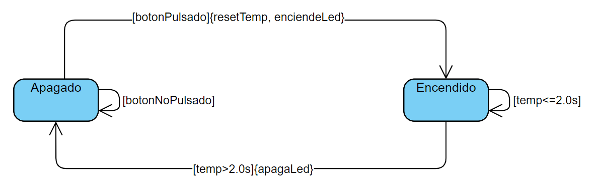

# Ejemplo de maquina de estados

Comenzamos en el estado apagado. Al pulsar el boton iniciamos un contador, encendemos el led y vamos al estado encendido.
En el estado encendido estamos hasta que pase 2 segundos y vamos al estado apagado. Apagamos el led.